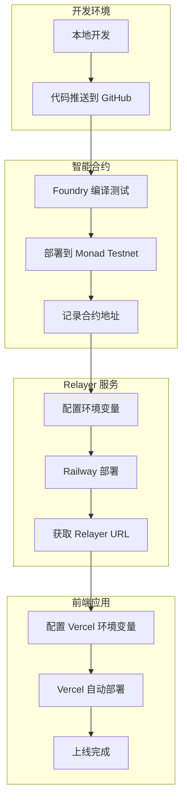

# MemeHunter 部署结构

> 三层架构的完整部署指南

---

## 一、系统架构概览

```
┌─────────────────────────────────────────────────────────────────────────────┐
│                              MemeHunter 部署架构                              │
└─────────────────────────────────────────────────────────────────────────────┘

                                    用户
                                      │
                                      ▼
┌─────────────────────────────────────────────────────────────────────────────┐
│                          前端 (Vercel)                                       │
│                                                                              │
│  域名: meme-hunter.vercel.app                                               │
│  技术栈: React + Vite + TypeScript + TailwindCSS                            │
│  框架: Vite                                                                  │
│  构建: npm run build → dist/                                                │
│                                                                              │
│  ┌──────────────────┐  ┌──────────────────┐  ┌──────────────────┐          │
│  │   钱包连接        │  │   游戏画布        │  │   Session Key    │          │
│  │   RainbowKit      │  │   Canvas          │  │   本地管理       │          │
│  └──────────────────┘  └──────────────────┘  └──────────────────┘          │
└─────────────────┬───────────────────────────────────────┬───────────────────┘
                  │ REST API                              │ WebSocket
                  │                                       │
                  ▼                                       ▼
┌─────────────────────────────────────────────────────────────────────────────┐
│                      Relayer 服务 (Railway / Fly.io)                         │
│                                                                              │
│  技术栈: Node.js + Express + Socket.io                                      │
│  端口: 3000 (HTTP) / WebSocket                                              │
│                                                                              │
│  ┌──────────────────────────────────────────────────────────────────────┐  │
│  │  API 端点                                                             │  │
│  │  • POST /api/hunt      - 执行狩猎                                     │  │
│  │  • GET  /api/nonce/:addr - 获取 nonce                                 │  │
│  │  • GET  /api/balance/:addr - 获取余额                                 │  │
│  │  • GET  /api/pool-balance - 获取池余额                                │  │
│  │  • GET  /api/leaderboard - 获取排行榜                                 │  │
│  └──────────────────────────────────────────────────────────────────────┘  │
│  ┌──────────────────────────────────────────────────────────────────────┐  │
│  │  WebSocket 事件                                                       │  │
│  │  • join / leave - 玩家进出                                            │  │
│  │  • gameState - Meme 位置同步                                          │  │
│  │  • netLaunch / huntResult - 狩猎广播                                  │  │
│  └──────────────────────────────────────────────────────────────────────┘  │
└─────────────────────────────────────┬───────────────────────────────────────┘
                                      │ RPC 调用
                                      ▼
┌─────────────────────────────────────────────────────────────────────────────┐
│                       智能合约 (Monad Testnet)                               │
│                                                                              │
│  链 ID: 10143                                                               │
│  RPC: https://testnet-rpc.monad.xyz                                         │
│  浏览器: https://testnet.monadexplorer.com                                  │
│                                                                              │
│  ┌──────────────────────────────────────────────────────────────────────┐  │
│  │  MemeHunter.sol                                                       │  │
│  │  • Session Key 管理                                                   │  │
│  │  • 空投池机制                                                         │  │
│  │  • 狩猎逻辑 + 伪随机判定                                              │  │
│  │  • 奖励发放                                                           │  │
│  └──────────────────────────────────────────────────────────────────────┘  │
└─────────────────────────────────────────────────────────────────────────────┘
```

---

## 二、部署组件详情

### 2.1 前端部署 (Vercel)

| 配置项 | 值 |
|--------|-----|
| **平台** | Vercel |
| **仓库** | RSXLX/MemeHunter |
| **分支** | main |
| **项目名称** | meme-hunter |
| **Framework Preset** | Vite |
| **Root Directory** | `./` (根目录) 或 `frontend/` |
| **Build Command** | `npm run build` 或 `vite build` |
| **Output Directory** | `dist` |
| **Install Command** | `yarn install` / `pnpm install` / `npm install` / `bun install` |

#### 环境变量

| Key | Value | 说明 |
|-----|-------|------|
| `VITE_RELAYER_URL` | `https://your-relayer.railway.app` | Relayer 服务地址 |
| `VITE_CONTRACT_ADDRESS` | `0x...` | MemeHunter 合约地址 |
| `VITE_CHAIN_ID` | `10143` | Monad Testnet Chain ID |

#### Vercel 部署配置截图


---

### 2.2 Relayer 部署 (Railway / Fly.io)

| 配置项 | 值 |
|--------|-----|
| **平台** | Railway 或 Fly.io |
| **技术栈** | Node.js 18+ |
| **入口文件** | `src/index.js` |
| **启动命令** | `npm start` |
| **端口** | 3000 |

#### Railway 部署步骤

```bash
# 1. 安装 Railway CLI
npm install -g @railway/cli

# 2. 登录
railway login

# 3. 初始化项目 (在 server/ 目录)
cd server
railway init

# 4. 部署
railway up
```

#### 环境变量

| Key | Value | 说明 |
|-----|-------|------|
| `RPC_URL` | `https://testnet-rpc.monad.xyz` | Monad RPC 地址 |
| `CONTRACT_ADDRESS` | `0x...` | MemeHunter 合约地址 |
| `RELAYER_PRIVATE_KEY` | `0x...` | Relayer 钱包私钥 |
| `PORT` | `3000` | 服务端口 |
| `CORS_ORIGIN` | `https://meme-hunter.vercel.app` | 前端域名 |

> [!CAUTION]
> **安全提示**: `RELAYER_PRIVATE_KEY` 必须使用环境变量配置，切勿硬编码或提交到代码仓库！

---

### 2.3 智能合约部署 (Monad Testnet)

| 配置项 | 值 |
|--------|-----|
| **链** | Monad Testnet |
| **Chain ID** | 10143 |
| **RPC URL** | `https://testnet-rpc.monad.xyz` |
| **区块浏览器** | `https://testnet.monadexplorer.com` |
| **框架** | Foundry |

#### 部署步骤

```bash
# 1. 进入合约目录
cd contracts

# 2. 安装依赖
forge install

# 3. 编译
forge build

# 4. 运行测试
forge test -vvv

# 5. 部署到 Monad Testnet
forge script script/Deploy.s.sol:DeployScript \
  --rpc-url https://testnet-rpc.monad.xyz \
  --broadcast \
  --private-key $DEPLOYER_PRIVATE_KEY
```

#### 合约地址记录

| 合约 | 地址 | 说明 |
|------|------|------|
| MemeHunter | `待部署后填写` | 主合约 |

---

## 三、部署流程图



---

## 四、项目目录结构

```
MemeHunter/
├── contracts/                    # 智能合约 (Foundry)
│   ├── src/
│   │   └── MemeHunter.sol       # 主合约
│   ├── script/
│   │   └── Deploy.s.sol         # 部署脚本
│   ├── test/
│   │   └── MemeHunter.t.sol     # 测试文件
│   ├── .env                     # 环境变量 (本地)
│   └── foundry.toml             # Foundry 配置
│
├── server/                       # Relayer 服务 (Node.js)
│   ├── src/
│   │   ├── index.js             # 入口
│   │   ├── config.js            # 配置
│   │   ├── routes/              # API 路由
│   │   ├── services/            # 业务逻辑
│   │   └── websocket/           # WebSocket
│   ├── .env                     # 环境变量 (本地)
│   └── package.json
│
├── frontend/                     # 前端 (React + Vite)
│   ├── src/
│   │   ├── pages/               # 页面
│   │   ├── components/          # 组件
│   │   ├── hooks/               # Hooks
│   │   ├── services/            # 服务
│   │   └── game/                # 游戏引擎
│   ├── .env                     # 环境变量 (本地)
│   ├── vite.config.ts
│   └── package.json
│
└── docs/                         # 文档
    ├── 01_需求设计/
    ├── 02_开发计划/
    └── 03_部署文档/
```

---

## 五、环境变量汇总

### 5.1 前端 (.env)

```env
# Relayer 服务地址
VITE_RELAYER_URL=https://your-relayer.railway.app

# 合约地址
VITE_CONTRACT_ADDRESS=0x...

# 链配置
VITE_CHAIN_ID=10143
VITE_RPC_URL=https://testnet-rpc.monad.xyz
```

### 5.2 Relayer (.env)

```env
# 端口
PORT=3000

# Monad RPC
RPC_URL=https://testnet-rpc.monad.xyz

# 合约地址
CONTRACT_ADDRESS=0x...

# Relayer 钱包私钥 (用于广播交易)
RELAYER_PRIVATE_KEY=0x...

# CORS
CORS_ORIGIN=https://meme-hunter.vercel.app
```

### 5.3 合约 (.env)

```env
# 部署者私钥
DEPLOYER_PRIVATE_KEY=0x...

# Relayer 地址 (合约初始化参数)
RELAYER_ADDRESS=0x...

# Monad RPC
RPC_URL=https://testnet-rpc.monad.xyz
```

---

## 六、部署检查清单

### 6.1 部署前检查

- [ ] 合约代码通过所有测试
- [ ] Relayer 钱包有足够的 MON 作为 Gas
- [ ] 环境变量配置正确
- [ ] CORS 配置匹配前端域名

### 6.2 部署后验证

- [ ] 合约地址在区块浏览器可查
- [ ] Relayer API 响应正常 (`/api/nonce/:addr`)
- [ ] WebSocket 连接成功
- [ ] 前端可连接钱包
- [ ] Session Key 授权流程正常
- [ ] 狩猎功能端到端测试通过

---

## 七、常见部署问题

### 7.1 Vercel 构建失败

**问题**: Root Directory 配置错误

**解决**: 
- 如果仓库根目录是整个项目，Root Directory 设置为 `frontend/`
- 如果前端在根目录，Root Directory 设置为 `./`

### 7.2 Relayer 无法连接合约

**问题**: RPC URL 或合约地址配置错误

**解决**: 
1. 检查 `RPC_URL` 是否为 `https://testnet-rpc.monad.xyz`
2. 确认 `CONTRACT_ADDRESS` 是部署后的实际地址

### 7.3 CORS 错误

**问题**: 前端无法调用 Relayer API

**解决**: 
确保 Relayer 的 `CORS_ORIGIN` 环境变量包含前端的完整域名

```javascript
// server/src/index.js
const cors = require('cors');
app.use(cors({
  origin: process.env.CORS_ORIGIN || 'http://localhost:5173'
}));
```

---

## 八、监控与运维

### 8.1 日志查看

```bash
# Railway
railway logs

# Vercel
vercel logs
```

### 8.2 健康检查

| 服务 | 健康检查端点 | 预期响应 |
|------|--------------|----------|
| Relayer | `GET /api/health` | `{ status: "ok" }` |
| 合约 | `getPoolBalance()` | 返回池余额 |

### 8.3 告警配置

建议配置以下监控告警:
- Relayer 服务宕机
- 空投池余额不足
- 交易失败率异常

---

> [!TIP]
> **最佳实践**: 建议先在测试环境完成全流程部署验证，确认无误后再部署生产环境。
